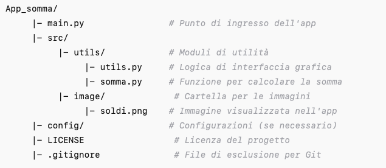

# SommaApp

**SommaApp** è un'applicazione desktop realizzata con Kivy che consente di calcolare la somma dei numeri da 1 a un numero intero inserito dall'utente. L'interfaccia grafica è semplice e intuitiva, con un'area di input per inserire il numero e un pulsante per avviare il calcolo.

### Funzionalità

- Inserisci un numero intero tramite l'area di testo.
- Clicca sul pulsante "CALCOLA!" per calcolare la somma dei numeri da 1 al numero inserito.
- Visualizza il risultato sotto il pulsante.
- Gestisce gli errori, mostrando un messaggio di errore se il valore inserito non è un numero intero valido.

### Struttura del Progetto

Ecco la struttura del progetto:



### Requisiti

- **Python 3.x**
- **Kivy**: una libreria Python per lo sviluppo di applicazioni GUI.

### Installazione

1. Clona questo repository:
   ```bash
   git clone https://github.com/Lorenzoanzivino/App_somma.git

2. Entra nella directory del progetto:
   ```bash
   cd App_somma

3. Installa le dipendenze:
   ```bash
   pip install kivy

4. Esegui l'app:
   ```bash
   python main.py runserver

### Come funziona

1. **Input**: L'utente inserisce un numero intero nell'area di testo.
2. **Calcolo**: Dopo aver cliccato il pulsante "CALCOLA!", l'app esegue il calcolo della somma dei numeri da 1 fino al numero inserito.
3. **Output**: Il risultato del calcolo viene visualizzato sotto il pulsante.
4. **Gestione errori**: Se l'utente inserisce un valore non valido (ad esempio, un carattere o un numero decimale), viene visualizzato un messaggio di errore.

### Contribuire

Se vuoi contribuire al progetto, segui questi passaggi:

1. Fork il repository.
2. Crea un ramo (git checkout -b feature-nome).
3. Fai le modifiche necessarie.
4. Commit le modifiche (git commit -am 'Aggiungi una nuova funzionalità').
5. Pusha il ramo (git push origin feature-nome).
6. Crea una pull request.

### Licenza

Distribuito sotto la licenza MIT. Vedi il file LICENSE per maggiori dettagli.

---
Questo README fornisce una panoramica completa del progetto, includendo come installarlo, utilizzarlo, e contribuire. Puoi aggiungere o modificare qualsiasi parte in base a come vuoi che venga utilizzato il tuo progetto!